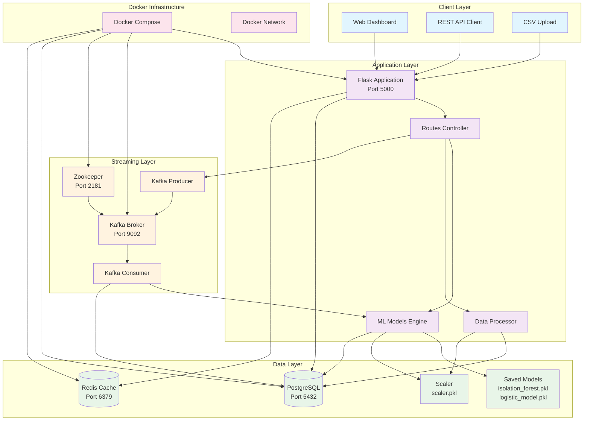
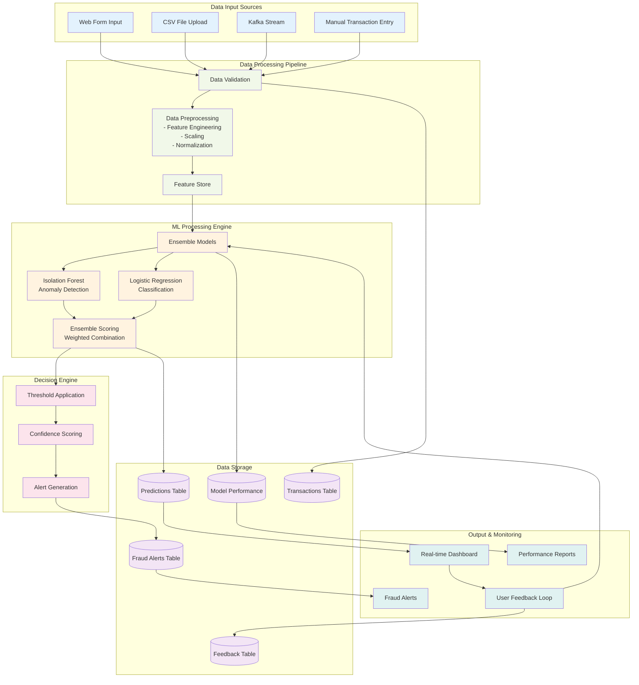
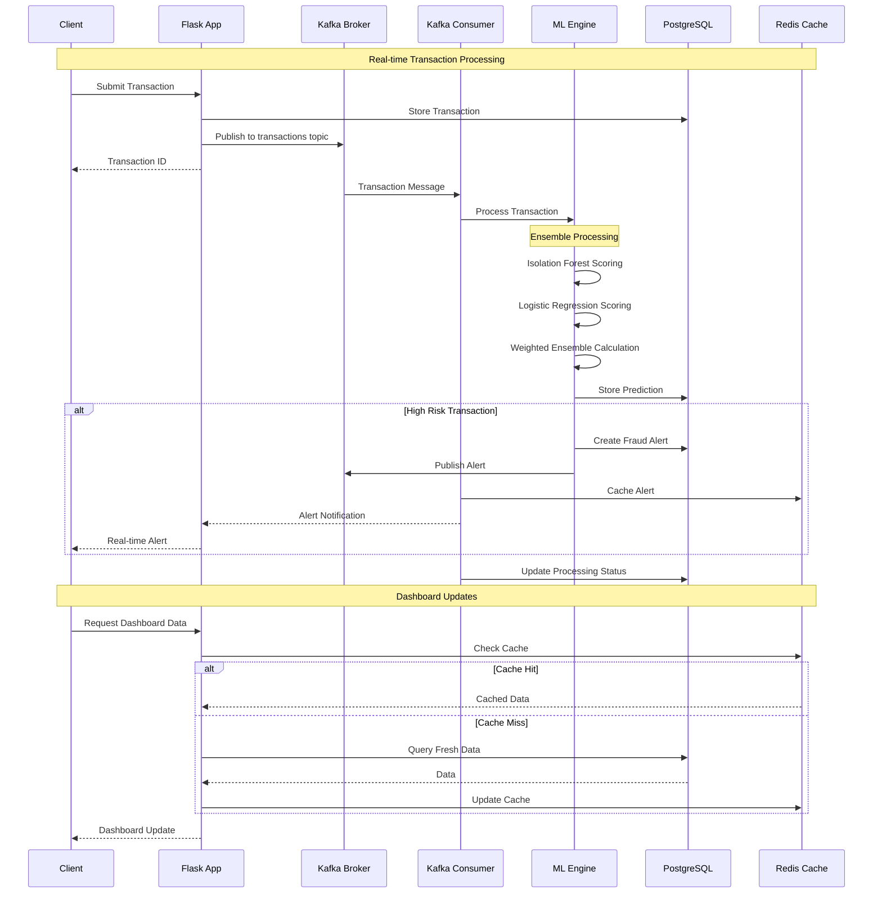
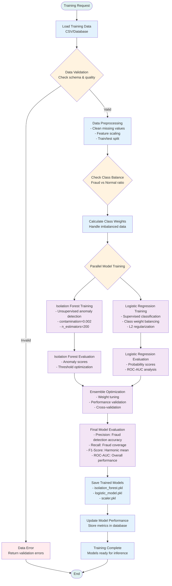
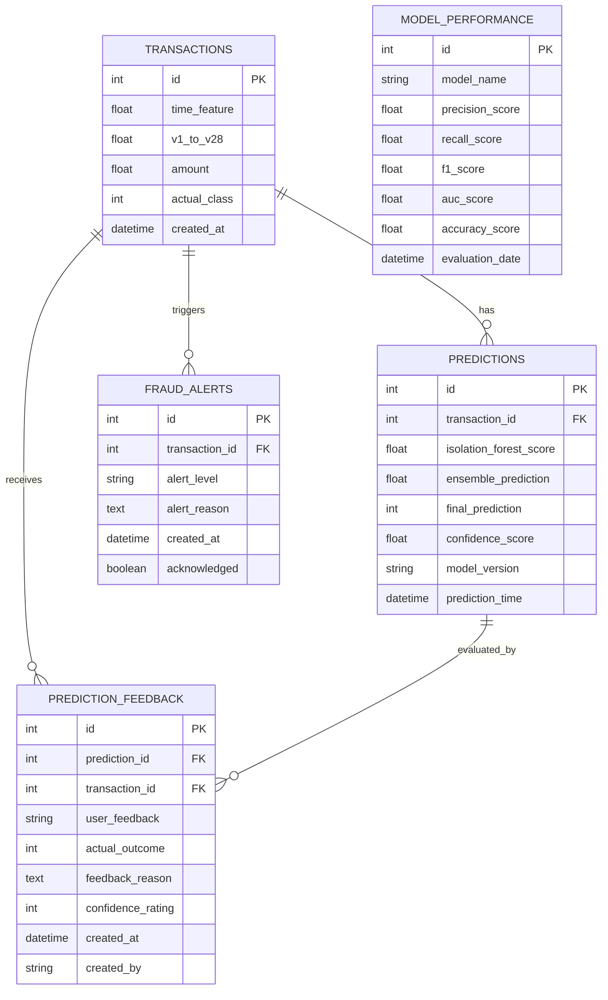
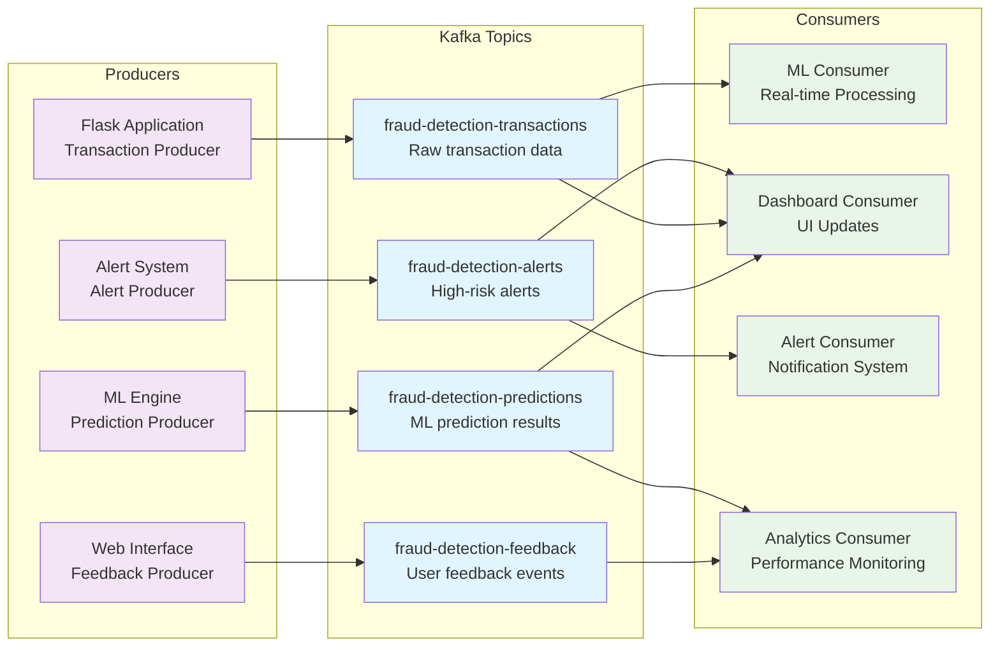
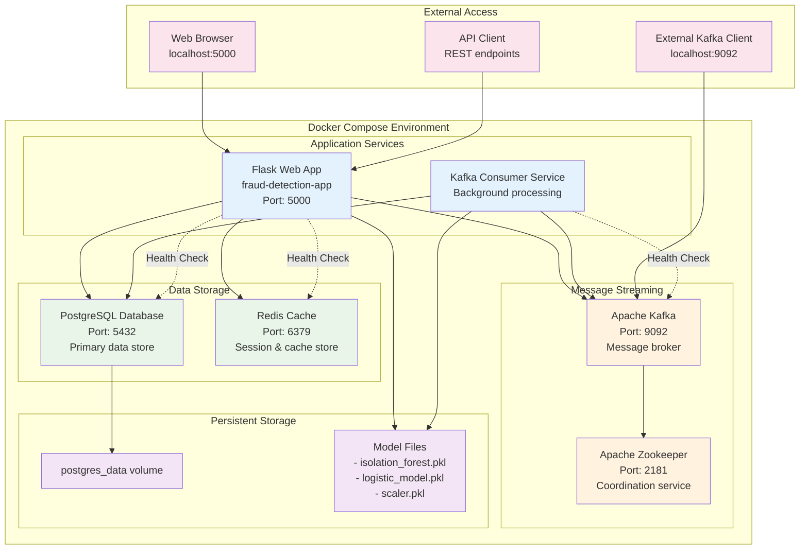
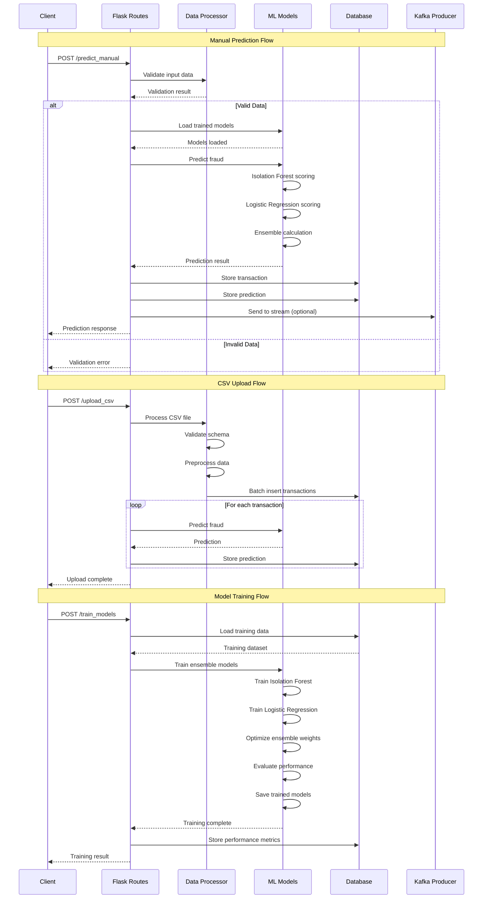
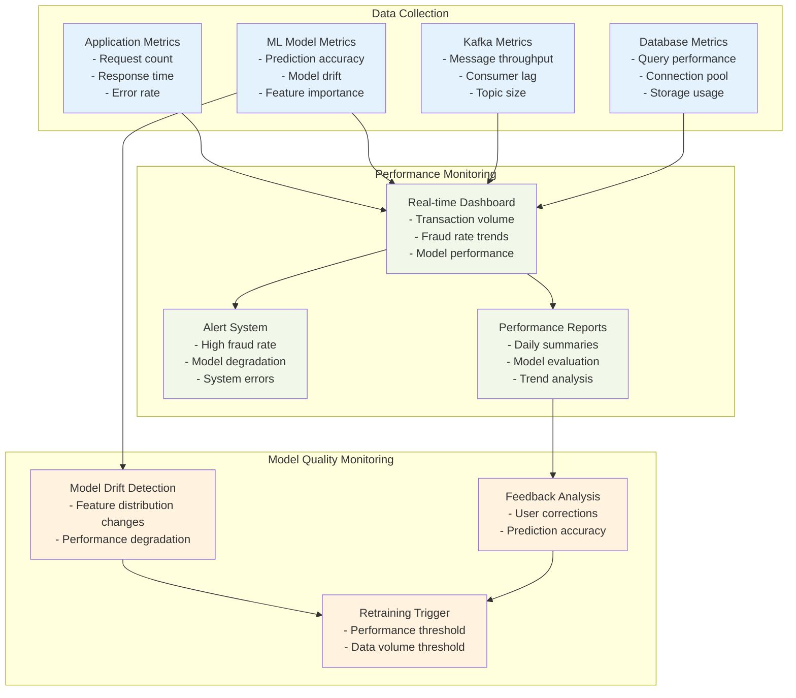

# System Diagrams

This document contains comprehensive diagrams for the Fraud Detection System architecture, data flow, and machine learning pipeline.

## System Architecture Diagram

## Data Flow Diagram

## ML Pipeline Diagram

```mermaid
flowchart TD
    subgraph "Data Ingestion"
        RawData[Raw Transaction Data<br/>29 PCA Features + Amount + Time]
        DataValidation[Data Validation<br/>- Missing value check<br/>- Schema validation<br/>- Range validation]
    end
    
    subgraph "Feature Engineering"
        TimeFeature[Time Feature Engineering<br/>- Temporal patterns<br/>- Cyclic encoding]
        AmountScaling[Amount Scaling<br/>- StandardScaler<br/>- Outlier handling]
        FeatureSelection[Feature Selection<br/>- PCA features V1-V28<br/>- Amount normalization]
    end
    
    subgraph "Model Training Pipeline"
        DataSplit[Train/Test Split<br/>80/20 ratio]
        
        subgraph "Isolation Forest Training"
            IsoTrain[Isolation Forest<br/>- contamination=0.002<br/>- n_estimators=200<br/>- max_samples=auto]
            IsoValidation[Anomaly Score<br/>Validation]
        end
        
        subgraph "Logistic Regression Training"
            ClassWeight[Class Weight<br/>Calculation<br/>Handle imbalance]
            LogTrain[Logistic Regression<br/>- max_iter=1000<br/>- solver=liblinear<br/>- L2 penalty]
            LogValidation[Classification<br/>Validation]
        end
        
        EnsembleWeights[Ensemble Weight<br/>Optimization<br/>ISO: 0.4, LOG: 0.6]
    end
    
    subgraph "Model Evaluation"
        MetricsCalc[Performance Metrics<br/>- Precision/Recall<br/>- F1-Score<br/>- ROC-AUC<br/>- Accuracy]
        CrossVal[Cross Validation<br/>Optional]
        ModelSave[Model Persistence<br/>- isolation_forest.pkl<br/>- logistic_model.pkl<br/>- scaler.pkl]
    end
    
    subgraph "Inference Pipeline"
        NewTransaction[New Transaction]
        FeaturePrep[Feature Preparation<br/>- Apply scaler<br/>- Feature alignment]
        
        subgraph "Ensemble Prediction"
            IsoPredict[Isolation Forest<br/>Anomaly Score]
            LogPredict[Logistic Regression<br/>Probability Score]
            WeightedScore[Weighted Ensemble<br/>Final Score Calculation]
        end
        
        ThresholdApply[Threshold Application<br/>Binary Classification]
        ConfidenceCalc[Confidence Score<br/>Calculation]
        AlertGen[Alert Generation<br/>Based on risk level]
    end
    
    subgraph "Feedback Loop"
        UserFeedback[User Feedback<br/>- Correct/Incorrect<br/>- Confidence rating<br/>- Reasoning]
        ModelUpdate[Model Retraining<br/>- Incorporate feedback<br/>- Performance monitoring]
        ContinuousLearning[Continuous Learning<br/>- Model drift detection<br/>- Auto-retraining triggers]
    end
    
    %% Data flow
    RawData --> DataValidation
    DataValidation --> TimeFeature
    DataValidation --> AmountScaling
    DataValidation --> FeatureSelection
    
    %% Training flow
    TimeFeature --> DataSplit
    AmountScaling --> DataSplit
    FeatureSelection --> DataSplit
    
    DataSplit --> IsoTrain
    DataSplit --> ClassWeight
    ClassWeight --> LogTrain
    
    IsoTrain --> IsoValidation
    LogTrain --> LogValidation
    
    IsoValidation --> EnsembleWeights
    LogValidation --> EnsembleWeights
    
    EnsembleWeights --> MetricsCalc
    MetricsCalc --> CrossVal
    CrossVal --> ModelSave
    
    %% Inference flow
    NewTransaction --> FeaturePrep
    FeaturePrep --> IsoPredict
    FeaturePrep --> LogPredict
    
    IsoPredict --> WeightedScore
    LogPredict --> WeightedScore
    WeightedScore --> ThresholdApply
    ThresholdApply --> ConfidenceCalc
    ConfidenceCalc --> AlertGen
    
    %% Feedback flow
    AlertGen --> UserFeedback
    UserFeedback --> ModelUpdate
    ModelUpdate --> ContinuousLearning
    ContinuousLearning --> ModelSave
    
    %% Model loading for inference
    ModelSave -.-> IsoPredict
    ModelSave -.-> LogPredict
    
    %% Styling
    classDef ingestion fill:#e3f2fd
    classDef feature fill:#f1f8e9
    classDef training fill:#fff3e0
    classDef evaluation fill:#fce4ec
    classDef inference fill:#f3e5f5
    classDef feedback fill:#e0f2f1
    
    class RawData,DataValidation ingestion
    class TimeFeature,AmountScaling,FeatureSelection feature
    class DataSplit,IsoTrain,LogTrain,ClassWeight,EnsembleWeights training
    class MetricsCalc,CrossVal,ModelSave evaluation
    class NewTransaction,FeaturePrep,IsoPredict,LogPredict,WeightedScore,ThresholdApply,ConfidenceCalc,AlertGen inference
    class UserFeedback,ModelUpdate,ContinuousLearning feedback
```

## Real-time Processing Flow

## Model Training Flow

## Database Schema Diagram

## Kafka Event Flow

## Deployment Architecture

## API Flow Diagram

## System Monitoring Flow

